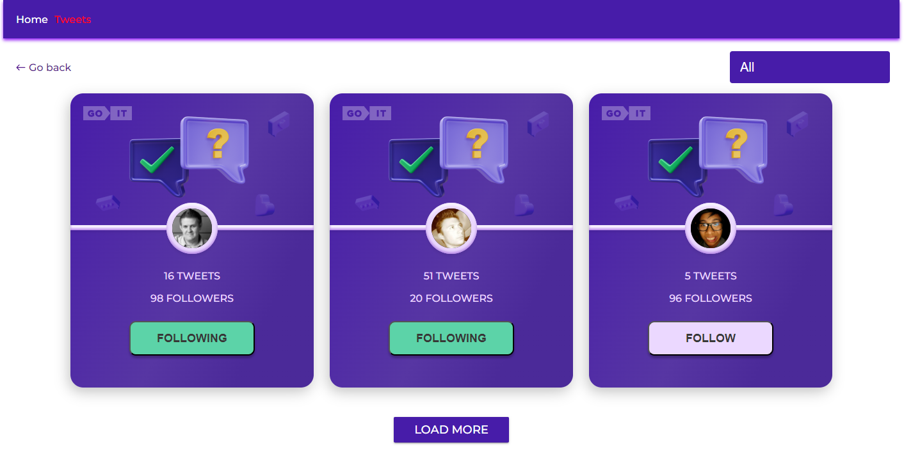

# Tweets app

## What does my app do

This application allows you to view users, the number of their tweets and followers.
And if necessary, you can follow any user. It takes user data from MockApi.
Data on whether you have followed a certain user is stored in Local Storage and on the backend of the selected user
+1 is added to followers. In the same way, one user is subtracted from the user on the backend when unfollow.
This allows you to share the app with other people and track the number of followers.

## How to use

Follow the link https://volodymyrderkach97.github.io/goit-react-test_task-tweets/
this link is also duplicated in the repository header.
The initial number of users on the page is three.
When you click "Load More", 3 more users will be uploaded and so on.
It is possible to use a filter. The "All" filter displays all users,
the "Follow" filter displays users on whom you are not followed
and the "Following" filter displays users you are already following.
Data is saved when switching between application tabs.

## Here is a usage example

The image shows the buttons with which you can follow and unfollow the user.
Also, a button with which you can upload more users. And the filter is shown.

## Data about the developer

The work was performed by Volodymyr Derkach.
If you find bugs, report them to the mail

email: bobikderkac@gmail.com

linkedin: https://www.linkedin.com/in/volodymyrderkach/

telegarm: https://t.me/volodymyr_derkach97
